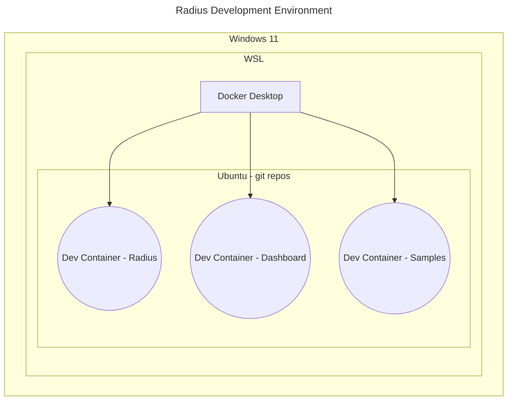

# Configuration Settings for Developing Radius on Windows/WSL

This repo contains dev machine setup resources for developing [Radius](https://github.com/radius-project/) on Windows 11.



*Figure 1: Development Environment architecture showing Windows 11, WSL, and Dev Container relationships. Git repos are cloned to WSL Ubuntu, and dev containers are launched from the git repos.*

## Contents

- `.configurations` folder: DSC configurations (that are applied to the machine using `winget`).
- `.devcontainer` folder: dev container definitions for testing Radius scenarios

## Prerequisites

Windows 11 with:

- `winget` version 1.6 or higher
- 32 GB RAM (minimum total machine memory, 64 GB is better)

## Installation Step-By-Step

1. Provision a new virtual machine with Windows 11.
1. Open Windows Terminal as administrator and run `.\.configurations\Set-WingetConfiguration`
1. Reboot (Required for WSL and Docker Desktop)

## How to Develop

1. Open a terminal window and launch the Ubuntu WSL distro.
2. Clone the [Radius repo](https://github.com/radius-project/radius) to a folder (on Ubuntu). Be sure to include submodules.

```bash
git clone https://github.com/radius-project/radius --recurse-submodules`

```

3. `cd` to the repo and launch VS Code

```bash
cd radius
code .
```

4. Launch the dev container. VS Code may prompt you to launch the dev container, or open the VS Code command palette and run the command to launch the dev container.

```text
Dev Containers: Rebuild and Reopen in Container
```

The first dev container build will take some time.
